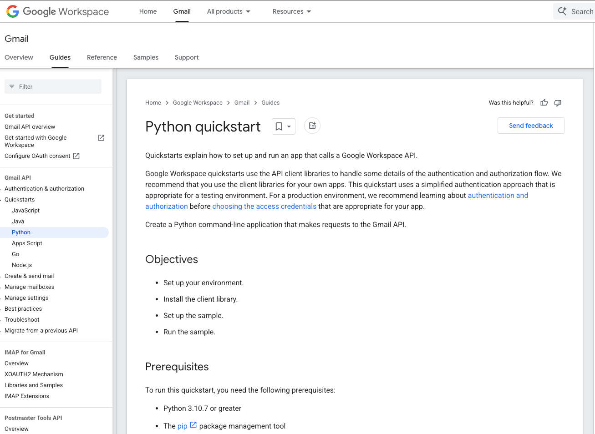
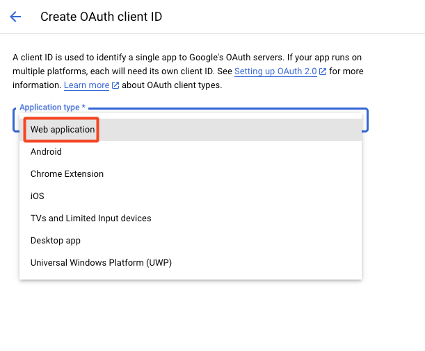
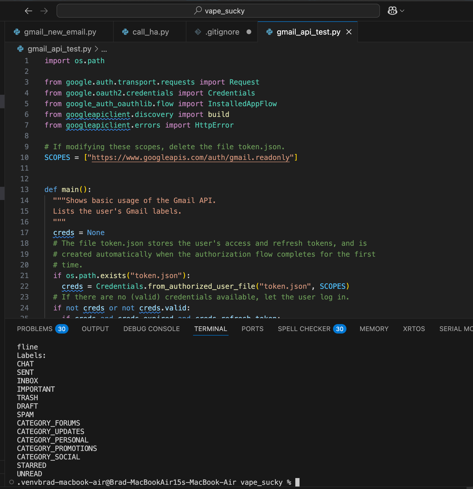
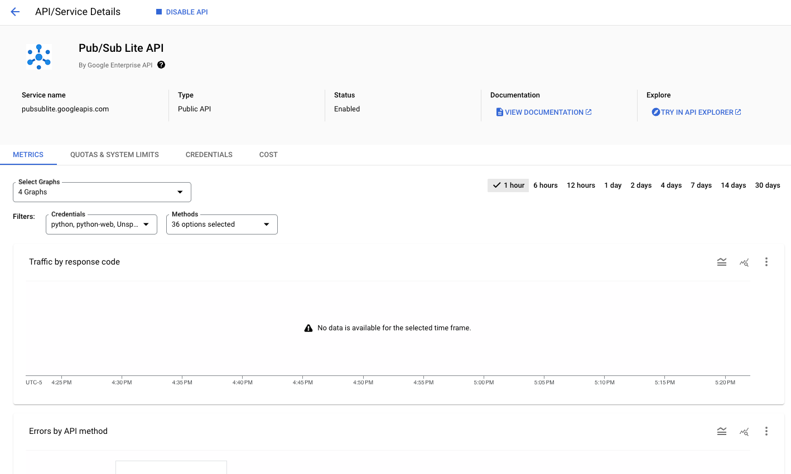
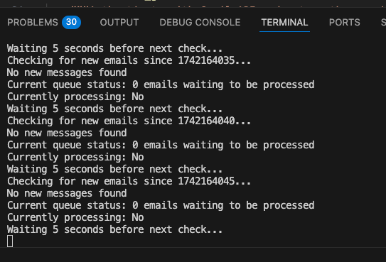
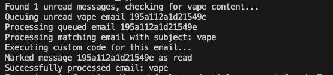

A goofy fun project to explore some new areas like microcontrollers, servos, and stepper motor programming with a Raspberry Pi Zero and Pico with an incredibly overcomplicated mechanism and equally over complicated code running it all.

# The Problem
Everyone always comes over to our house and wants to hit anyone and everyone's vape. This obviously causes a lot of tension as those with a vape feel that they are losing precious puffs at the cost of what? A burnt coil? Everyone's gross mouth juice? It's a real problem, and a real problem deserves a real solution. This sparked a conversation, how can we solve this? Obviously we need to over engineer a super complicated means to give the people what they want, but at a cost. What is that cost you might ask? Well only some public shame and $1 on Venmo of course!

# The Idea
Here's the idea, we have a box mounted on the support pole in the center of the basement that houses the precious puffer. To access it, you gotta pay up, $1 to start, and after you pay up, you have to sit through the song and dance of shame. The lights go into casino mode, music plays, a countdown starts, and the vape presents itself from the box for a set amount of time. Drink up while you can because the sweet puff juice will retreat back to its home in 15 short seconds.

It sounds crazy, I know, but the execution of something like this started to sound like a really fun project and a really fun opportunity to mess with some stuff that I have never had a reason to use, but always wanted to. Getting to play around with servos and stepper motors and some new Raspberry Pi's was quite appealing. On top of that this was going to require quite a bit of code and some integration with my Home Assistant as well as some 3rd party APIs which is always fun to play with that. Lastly, getting to use a new tool, Onshape, for some 3D modeling in the browser which I have been wanting to give a try and see if I can transition from Fusion360.

# The Execution

## First things first, a trip to Microcenter
The first step to any good project is always a trip to Microcenter. This time I needed some new Raspberry Pi's. I spent some time researching the various micro controllers out there like the ardiuno nano but came to the conclusion I wanted to stay with Raspberry Pi since I could make use of the MicroPython implementation but quickly learned that ardiuno supports it too, oh well. I grabbed a new Pi Zero 2 and Pico 2 just for safe measure since I was not exactly sure if I was going to be able to do everything I needed with the Pico 2. I have no idea what the Python code is going to turn into and was a bit worried it could overload that board, but I do want something that is low power, so we will see in the end which one makes the most sense. Regardless, I am sure I will find another project to use whichever one I don't use on this one.

Along with that I also got some breadboards, dupoint wires, and some continous rotation servos from Amazon.

At this point I felt I had more than enough things for this project and was not really sure if I was even going to use all of this stuff, but like I said, I have always wanted to do more with servos and steppers and what not so I figured it was an *investment*.

<<<<<<insert pic of MC haul>>>>>>

## The Model
For this project I am using Onshape, some friends wanted to help model and collaborate so this was the obvious choice and is something that I have wanted to try for a while since Fusion is a bit clunky, and they are putting so many things behind a paywall that it is a shell of what it once was with the hobbyist license.

We started with an initial design that is pretty barebones as we were trying to determine the best way to have a platform that could handle vapes of a universal size, be easily 3D printed, and would allow it to present itself out of a cellar door type mechanism for dramatic effect. We also wanted to be able to change the speed at which it popped out and so we needed something that would allow us to have quick and reliable movement and speed changes.

With this V1 design we are thinking to have a platform that sits in the ridges on the side that are used as guides to help the platform stay stable while moving up and down inside the box. We also needed a mechanism to motorize this platform and be relatively simple and compact. After a lot of back and forth with using corkscrews, pulleys, and other not as smart gearing mechanisms, we finally realized the easiest thing to do would be attach the motor to the platform itself and have a toothed interface on the back wall that a gear on the motor would interact with to lift and lower the platform.

At this stage things are very rough and mostly being designed in their most basic form to see if the idea even works, once we can validate that it does, some improving and cleaning up will need to be done to get a bit more polished. We'll see how that all progresses throughout this article.

## The Code

### How do we accept payments and notify the Pi to execute the presentation ensemble?
This was an interesting challenge. At first we talked about just putting a coin slot on the box that would in a very basic form, hit a lever that would notify the Pi to execute the code. This is simple enough, but is just that, too simple. We need something way too complex that makes use of some sort of P2P payment app because realistically, who carries coins around these days?

For my friends the obvious choice was Venmo since everyone already has an account and that is our primary means to share funds with one another, but how are we going to integrate with it? Well the obvious answer would be to make use of an API, but of course, that doesn't exist. At least as long as you are not a dev from 2016. Bummer.

 
So what is next then? Maybe creating a new account just for the vape box so that I can do something like integrate the emails that are sent for notifications into some code? This seems promising.. Nope. Can't have a random account used for sharing and receiving money that is not tied to a real user, something about money laundering and taxes? Another bummer.

 
What do we do now? Well we could still try to do something with those email notifications. You can configure Venmo to send you notifications for sending and receiving money from people. That means that we can use those and some integration with Gmail as our trigger but means that I will have to use my personal Venmo account, which is fine but also means I would have to have an integration that can read all of my emails, which I am not so fond of.

 
Thankfully with most email providers, Gmail included, you can setup forwarding rules that look for specific things in an email and will forward them to another address. This is perfect for the use case here, we just need to create a filter in Gmail and then set up the forwarding rules to use that filter to send any emails matching it to another account. That other account we can then setup an API integration that will look in the inbox for any new emails and if it finds one, take action in the form of executing the python code to set off the vape unlocking process.

 
If we check our other Gmail inbox we can see it worked like a charm, we have the Venmo email here and now we can setup our integration.

### Gmail API Integration
Google has a very well documented python API integration which has detailed instructions on how to setup an integration with your account and how to get connected with a test API call.

 
The easiest thing to do is follow [this](https://developers.google.com/gmail/api/quickstart/python) quickstart to get up and running. This will get the basic functionality setup and the token that can be used. There is some work that I am going to have to do to ensure that we have a token that will be valid to keep this up and running which will have to be explored later, but for now following this has gotten the basics up and running.

 
One thing to note, is that depending on how you are going to do the API integration, you may not want to follow exactly how that guide from google instructs you to setup the clients, specifically at [this](https://developers.google.com/gmail/api/quickstart/python#authorize_credentials_for_a_desktop_application) part under step 3, I found that I needed to setup a web app instead of a desktop app to get some of the things that I needed in python for what I was looking for.

 
Once you get it setup though, you will be given a credentials.json file that is used to request your oauth token to use for the API. When you first run the code, it will open the browser and have you authenticate with your google account and accept and verify that you are using an unsupported integration. This will then respond with a token.json that will be used for authentication. This is the part that I still need to figure out how to manage a bit better since that token will expire and need to be re-issued, and thus the token file deleted and interactive login completed. That won't work if I have this code running headless and need to be running on its own for a while.

 

#### The Python Code
Now that we authenticate to Gmail, lets check out the code that I am using and what I wanted it to do. For this to all work seamlessly there needs to be a near 0 second interaction between the Venmo email being received by our vape box email and the execution of the python code to start the vape unlocking sequence. I also wanted some fault tolerance if for example the processing fails, or there is more than one email that is sent into the inbox in a short succession, so the code needs to queue these requests and it needs to make the emails read that it has processed successfully.

This is getting complicated quick, and is a bit more than I wanted to code by hand for just this purpose since there are still a lot of other things to figure out with this project, so ChatGPT to the rescue. I was able to discover there is an API endpoint and framework that Google has called pub/sub lite. This is a push notification framework that you can call to with a python library to get near real time notification of new emails in any inbox. This is perfect because this will keep the need to query the inbox every second for a new email which will certainly hit some sort of API throttling or limit on the Gmail side after a while. From what I can tell pub/sub gives you 1,000,000 requests per day, which we are querying every 5 seconds which we won't be close to hitting this limit.

 
The code that I have is written by ChatGPT and with some slight modifications and adjustments to the actual name of the pub/sub library we were up and running, the code checks for new emails every 5 seconds against the push notification end point, and if it finds an email, it will read it, look for our keyword of vape and then process whatever code we put in there. The API will then mark the email as read as long as the return result from the code it calls is successful. If there are multiple emails it will queue them up and process one at a time, that way if more than person wants to use the vape, they get the same experience as the first person. Don't want to make anyone feel left out! This functionality is also helpful if something goes wrong with the code and things need to be restarted, it will pick up where it left off and see the unread emails and process them without any additional intervention.

### Time to set the stage
With all the extra work to integrate this with the Gmail API and make it work with Venmo, I couldn't just stop there. I also wanted to make use of some of the smart home items that I have, specifically some Govee rope lights and Nanoleaf shapes that I have in the basement along with a Google home mini for some music.

The idea with this is to turn the basement into a game show casino with flashing lights and some game show music while the person waits for their turn on the nicotine carousel. In theory this should be pretty easy since I have home assistant running and have all of those devices integrated already.. That is in theory however, and in practice, as most things are, it was not so simple for a couple of reasons.

#### Govee Integration
The first major hurdle that I ran into was something I figured would be the easiest thing to get setup and working. I have the Govee rope lights integrated to my HA using the MQTT to Govee community integration which makes use of the web API for Govee. I had this setup because I have some Govee devices that did not have the LAN API available and well it was just easier to put everything under this. I don't like having to rely on the cloud for communicating with these devices, but it works alright, and they are own their own IoT network and VLAN so I am not too worried. 

This brought forth some unforseen challenges though, specifically with how Govee handles user created scenes. See I wanted to create a custom scene with the lights that was remenincent of a game show set of lights that was super bright, colorful, and flashing, which after much struggle using their less than ideal mobile app was possible. The problem was, in the Govee integration in HA, this custom scene that I created was not showing. After some digging around I came to find out that Govee doesn't present user created scenes as part of their default configuration with the API which the Govee to MQTT integration is leveraging. This meant that if I wanted to activate my custom scene, I was going to have to call the API myself.

What should have been a simple task turned into quite a bit of poking around until I was able to slightly reverse engineer how their API works to get it to apply the scene that I wanted. The problem here was that the API documentation from Govee seemed to allude that it was not possible to do what I was trying to do, that you could not call and activate a custom scene. I had some experience with this API though when I was trying to setup some custom integrations for some air purifiers that I picked up from Govee as well. I knew that their documentation was not the best and missing some features and calls that you could do to the devices so I thought the same might be true here as well.

Part of the problem was that I was using a Postman collection that was slightly outdated and I was also referencing [this](https://govee-public.s3.amazonaws.com/developer-docs/GoveeDeveloperAPIReference.pdf) API documentation which I came to learn is out of date, but regardless, I was able to get about 99% of the way there until I realized I could have just looked at their new API documentation portal [here](https://developer.govee.com/reference/get-you-devices) and it would have answered all my questions and saved quite a bit of headache.

Well, without realizing that, what I ended up doing was taking a query that I had done on the air purifiers that I have that was aimed to get the device state. The name of this call is a bit misleading as it returns all of the capabilities of a particular Govee device and that is what I used before to figure out what kind of calls I could make and what was possible with the purifiers. Doing that here and analyzing the output I found this dynamic_scene capability with diyScene listed as the instance. This seemed like exactly what I needed, only problem is, what is that value for the diyScene?

 
I tried some calls to that endpoint specifying various different numbers and I was getting results, but they were not the results that I was hoping for. I wasn't sure at this point how I was going to find the value for the diyScene that I made since seemingly at this point I could not just query that as I was not finding information online about what endpoint to call if there even was one. It was then that I realized it had been right in front of me this whole time on that new API site that Govee has where there is the outline for how to query the diyScenes to get the unique ID associated with them and how to call to activate it. So with that knowledge in hand I was able to get the value and set it on my Govee lights and it worked perfectly.

 

#### HA and Nanoleaf Integration
Thankfully the Nanoleaf integration with HA picks up the custom made scenes/profiles that you can create in the app. This meant that all I had to do was call that scene from within HA as part of an API call to that particular entity. This is relatively straight forward but I did run into some challenges trying to figure out exactly how to handle this. At first I wanted to create and call a scene from within HA, but I quickly learned that scenes only set the state defined, they do not unset the state defined, so if I had the Nanoleaf's go into game show mode, there was no easy way to revert them back to what they were. For this I decided that I was going to solve with just calling the current state, saving it, then calling the game show state, and once done then setting it back to what it originally was. This made me realize I should probably try and do that with the Govee lights as well.