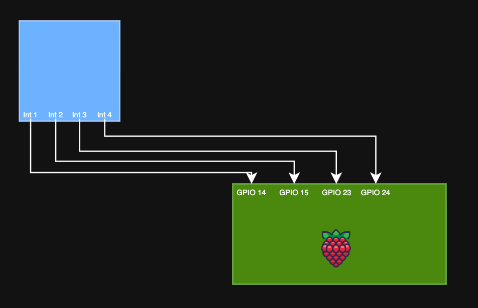

A goofy fun project to explore some new areas like microcontrollers, servos, and stepper motor programming with a Raspberry Pi Zero and Pico with an incredibly overcomplicated mechanism and equally over complicated code running it all.

# The Problem
Everyone always comes over to our house and wants to hit anyone and everyone's vape. This obviously causes a lot of tension as those with a vape feel that they are losing precious puffs at the cost of what? A burnt coil? Everyone's gross mouth juice? It's a real problem, and a real problem deserves a real solution. This sparked a conversation, how can we solve this? Obviously we need to over engineer a super complicated means to give the people what they want, but at a cost. What is that cost you might ask? Well only some public shame and $1 on Venmo of course!

# The Idea
Here's the idea, we have a box mounted on the support pole in the center of the basement that houses the precious puffer. To access it, you gotta pay up, $1 to start, and after you pay up, you have to sit through the song and dance of shame. The lights go into casino mode, music plays, a countdown starts, and the vape presents itself from the box for a set amount of time. Drink up while you can because the sweet puff juice will retreat back to its home in 15 short seconds.

It sounds crazy, I know, but the execution of something like this started to sound like a really fun project and a really fun opportunity to mess with some stuff that I have never had a reason to use, but always wanted to. Getting to play around with servos and stepper motors and some new Raspberry Pi's was quite appealing. On top of that this was going to require quite a bit of code and some integration with my Home Assistant as well as some 3rd party APIs which is always fun to play with that. Lastly, getting to use a new tool, Onshape, for some 3D modeling in the browser which I have been wanting to give a try and see if I can transition from Fusion360.

# First things first, a trip to Microcenter
The first step to any good project is always a trip to Microcenter. This time I needed some new Raspberry Pi's. I spent some time researching the various micro controllers out there like the ardiuno nano but came to the conclusion I wanted to stay with Raspberry Pi since I could make use of the MicroPython implementation but quickly learned that ardiuno supports it too, oh well. I grabbed a new Pi Zero 2 and Pico 2 just for safe measure since I was not exactly sure if I was going to be able to do everything I needed with the Pico 2. I have no idea what the Python code is going to turn into and was a bit worried it could overload that board, but I do want something that is low power, so we will see in the end which one makes the most sense. Regardless, I am sure I will find another project to use whichever one I don't use on this one.

Along with that I also got some breadboards, dupoint wires, and some continous rotation servos from Amazon.

At this point I felt I had more than enough things for this project and was not really sure if I was even going to use all of this stuff, but like I said, I have always wanted to do more with servos and steppers and what not so I figured it was an *investment*.

# Execution

## The Model
For this project I am using Onshape, some friends wanted to help model and collaborate so this was the obvious choice and is something that I have wanted to try for a while since Fusion is a bit clunky, and they are putting so many things behind a paywall that it is a shell of what it once was with the hobbyist license.

We started with an initial design that is pretty barebones as we were trying to determine the best way to have a platform that could handle vapes of a universal size, be easily 3D printed, and would allow it to present itself out of a cellar door type mechanism for dramatic effect. We also wanted to be able to change the speed at which it popped out and so we needed something that would allow us to have quick and reliable movement and speed changes.

With this V1 design we are thinking to have a platform that sits in the ridges on the side that are used as guides to help the platform stay stable while moving up and down inside the box. We also needed a mechanism to motorize this platform and be relatively simple and compact. After a lot of back and forth with using corkscrews, pulleys, and other not as smart gearing mechanisms, we finally realized the easiest thing to do would be attach the motor to the platform itself and have a toothed interface on the back wall that a gear on the motor would interact with to lift and lower the platform.

With this basic design we figured this should work well and took quite a few iterations to get everything just right. One of the bigger problems to manage was how to reduce the friction of the movement, reduce racking, and also get the motor to support its own weight, the tray, the vape, and the movement upwards against the plastic. This was proving to be quite challenging since the motor is severely underpowered for this application. We are essentially operating at the exact limit of the motor and any additional load causes it not to move. Thankfully one of my friends that also 3D prints a lot of things suggested that I print the tray so that the layer lines were perpendicular to the main vape box. This would mean that there is no friction between the layer lines of the 2 prints and this was a genius idea. I printed the tray horizontially with supports on the inside and it worked perfectly, there was almost no friction between the moving parts. This method also allowed the tolerances to be super tight which meant that it would not rack in the assembly when raising and lowering.

The next problem that I ran into was the doors that I wanted to use. I originally wanted these folding doors that would dramatically unfold as the vape was being raised. These would have small rubber bands connected to them to have some tension so that they closed when the vape was lowered, but because we were operating at the limits of the motors power no matter what I did I could not get enough torque from the motor to overcome the weight and friction that these doors added to everything. I tried a handful of things but could not get them to work in the real world.

What I ended up settling on was the port hole method. This was not my preferred option but it was one that was simple and worked, and at this point that is what I needed. I was losing steam on this project and just wantd to get it done and working so I could show it off.

Throughout this process there was a lot of iterations that had to be made to see how things were going to work in the real world. There was also a lack of knowledge that I had for making a complext assembly in Onshape that was hurting me as well. I thought that maybe I could get away with printing a couple of test pieces and then adjusting them to be 'close enough'. That was not the case. I really needed to figure out how to assemble everything the right way in Onshape...

After quite a few hours watching some videos and trying things out with the model I was able to get everything assembled in Onshape like it would be in the real world and I was finally able to see how everything would interact without needing to print everything. This was super helpful because I was able to fix a lot of would be problems before I did the printing now.

With the design issues figured out this is the final design that was settled on from a couple different viewpoints.

## How do we accept payments and notify the Pi to execute the presentation ensemble?
This was an interesting challenge. At first we talked about just putting a coin slot on the box that would in a very basic form, hit a lever that would notify the Pi to execute the code. This is simple enough, but is just that, too simple. We need something way too complex that makes use of some sort of P2P payment app because realistically, who carries coins around these days?

For my friends the obvious choice was Venmo since everyone already has an account and that is our primary means to share funds with one another, but how are we going to integrate with it? Well the obvious answer would be to make use of an API, but of course, that doesn't exist. At least as long as you are not a dev from 2016. Bummer.

 
So what is next then? Maybe creating a new account just for the vape box so that I can do something like integrate the emails that are sent for notifications into some code? This seems promising.. Nope. Can't have a random account used for sharing and receiving money that is not tied to a real user, something about money laundering and taxes? Another bummer.

 
What do we do now? Well we could still try to do something with those email notifications. You can configure Venmo to send you notifications for sending and receiving money from people. That means that we can use those and some integration with Gmail as our trigger but means that I will have to use my personal Venmo account, which is fine but also means I would have to have an integration that can read all of my emails, which I am not so fond of.

 
Thankfully with most email providers, Gmail included, you can setup forwarding rules that look for specific things in an email and will forward them to another address. This is perfect for the use case here, we just need to create a filter in Gmail and then set up the forwarding rules to use that filter to send any emails matching it to another account. That other account we can then setup an API integration that will look in the inbox for any new emails and if it finds one, take action in the form of executing the python code to set off the vape unlocking process.

 
If we check our other Gmail inbox we can see it worked like a charm, we have the Venmo email here and now we can setup our integration.

## Time to set the stage
I wanted to make use of some of the smart home items that I have, specifically some Govee rope lights and Nanoleaf shapes that I have in the basement along with a Google home mini for some music.

The idea with this is to turn the basement into a game show casino with flashing lights and some game show music while the person waits for their turn on the nicotine carousel. In theory this should be pretty easy since I have home assistant running and have all of those devices integrated already.. That is in theory however, and in practice, as most things are, it was not so simple for a couple of reasons.

### Govee Integration
The first major hurdle that I ran into was something I figured would be the easiest thing to get setup and working. I have the Govee rope lights integrated to my HA using the MQTT to Govee community integration which makes use of the web API for Govee. I had this setup because I have some Govee devices that did not have the LAN API available and well it was just easier to put everything under this. I don't like having to rely on the cloud for communicating with these devices, but it works alright, and they are own their own IoT network and VLAN so I am not too worried. 

This brought forth some unforseen challenges though, specifically with how Govee handles user created scenes. See I wanted to create a custom scene with the lights that was remenincent of a game show set of lights that was super bright, colorful, and flashing, which after much struggle using their less than ideal mobile app was possible. The problem was, in the Govee integration in HA, this custom scene that I created was not showing. After some digging around I came to find out that Govee doesn't present user created scenes as part of their default configuration with the API which the Govee to MQTT integration is leveraging. This meant that if I wanted to activate my custom scene, I was going to have to call the API myself.

What should have been a simple task turned into quite a bit of poking around until I was able to slightly reverse engineer how their API works to get it to apply the scene that I wanted. The problem here was that the API documentation from Govee seemed to allude that it was not possible to do what I was trying to do, that you could not call and activate a custom scene. I had some experience with this API though when I was trying to setup some custom integrations for some air purifiers that I picked up from Govee as well. I knew that their documentation was not the best and missing some features and calls that you could do to the devices so I thought the same might be true here as well.

Part of the problem was that I was using a Postman collection that was slightly outdated and I was also referencing [this](https://govee-public.s3.amazonaws.com/developer-docs/GoveeDeveloperAPIReference.pdf) API documentation which I came to learn is out of date, but regardless, I was able to get about 99% of the way there until I realized I could have just looked at their new API documentation portal [here](https://developer.govee.com/reference/get-you-devices) and it would have answered all my questions and saved quite a bit of headache.

Well, without realizing that, what I ended up doing was taking a query that I had done on the air purifiers that I have that was aimed to get the device state. The name of this call is a bit misleading as it returns all of the capabilities of a particular Govee device and that is what I used before to figure out what kind of calls I could make and what was possible with the purifiers. Doing that here and analyzing the output I found this dynamic_scene capability with diyScene listed as the instance. This seemed like exactly what I needed, only problem is, what is that value for the diyScene?

 
I tried some calls to that endpoint specifying various different numbers and I was getting results, but they were not the results that I was hoping for. I wasn't sure at this point how I was going to find the value for the diyScene that I made since seemingly at this point I could not just query that as I was not finding information online about what endpoint to call if there even was one. It was then that I realized it had been right in front of me this whole time on that new API site that Govee has where there is the outline for how to query the diyScenes to get the unique ID associated with them and how to call to activate it. So with that knowledge in hand I was able to get the value and set it on my Govee lights and it worked perfectly.

 

### HA and Nanoleaf Integration
Thankfully the Nanoleaf integration with HA picks up the custom made scenes/profiles that you can create in the app. This meant that all I had to do was call that scene from within HA as part of an API call to that particular entity. This is relatively straight forward but I did run into some challenges trying to figure out exactly how to handle this. At first I wanted to create and call a scene from within HA, but I quickly learned that scenes only set the state defined, they do not unset the state defined, so if I had the Nanoleaf's go into game show mode, there was no easy way to revert them back to what they were. For this I decided that I was going to solve with just calling the current state, saving it, then calling the game show state, and once done then setting it back to what it originally was. This made me realize I should probably try and do that with the Govee lights as well.

## The Motor Conundrum
Something that I learned somewhat early on in this project is that the continuous rotation servos that I got from Amazon were not really the right motors for the job. In theory they sounded perfect, but what I learned was that I could not control them that I had hoped. 

I could have probably made this work if I really wanted to, but thankfully a friend already had a set of 28BYJ-48 steppers with the ULN2003 control board that I quickly learned were the cheap and go to option for a project like this.

.png>)

The problem that I had with the motors I got from Amazon was that they were servos which meant that they way they are controlled is fundementally different than that of how you control steppers. With a servo you are applying power and sending a control signal to the motor that lasts for a specific amount of time. There is no real way to control exactly how long or far the motor will travel. If you were to run the program and tell the motor to run for 5 seconds, each time you ran it, you would get a slightly different amount of distance from the motor. I learned that motors like this were best used in applications like an RC car where it doesn't really matter how far the motor travels given a set of input, you just want it to be running for X amount of input time like for example when you press the gas and want the car to go forward.

Thankfully I was able to much more easily use the stepper motors and had full control over just how much distance they were going to cover so I could easily and repeatably use them to move the vape up and down the track in the box. These worked perfectly, the only problem was that the motor is a bit under powered. It caused me to have to redesign a bit of the box because of this and there are ways to [overvolt](https://everythingsmarthome.co.uk/converting-the-28byj-48-stepper-motor-for-more-torque/) these steppers, but would then require that I have a 12v PSU connected and really I wanted to keep this as simple as possible and wanted to run everything off a small battery backup.

## The Raspberry Pi Setup
This is honestly the most straight foward part of this entire build. When I went to Microcenter I picked up a Raspberry Pi Zero 2 W and a Raspberry Pi Pico 2 as I wanted this to be a super low power build. What I quickly learned however was that the Pi Pico runs micropython, and that only has a very limited subset of python libraries available and a lot of the ones that I needed to run all the python code are not compatible. Now I could have ran the base code on my server and then just made a call to execute the python script that would just make the motor go, and this was what I was already doing when I was testing, but I wanted this to be a fully self contained system and I didn't want to have to have something running on a server somewhere else. Also I am pretty sure the Pico 2's power output would not have been enough for the stepper motor, and I did not get the soldered header Pico, so that would have been a lot of extra work as well.

With it settled that I was going to use the Zero 2 W, things were a lot easier, the model I got had soldered headers and the Zero has an additonal power input incase you need it (I thankfully did not). The Zero 2 W can also run full Raspberry Pi OS so there was no need to adjust any of the code I had written and it allowed me to go a bit overboard which you'll see at the end of this article.
The setup like I said was really straight forward, all you have to do is follow the normal steps to get Raspberry Pi OS installed on an SD card and then pop it into the Pi. From there I just had to take the stepper motor and plug it into the controller that it came with and then from the controller hook up some dupont wires to each various input and then wire that to the Pi. For the steppers I was using, there was 5v power, ground, and then 4 control inputs. Those 3 control inputs just need to be plugged into any 4 GPIO headers on your Pi and just make sure to note which ones you used because you will need them when you write you code. 

One thing to note is that the order of them does matter, so when you plug them in, it is best to match the input on the stepper control board to the lowest numbered GPIO that you select, and then for the next control input, increment however, but make sure it is the next successive control input and that the GPIO header is higher than the first. The last one just make sure it is the highest GPIO pin of the 3 others you already picked. This will just save some headache when you go to code things and wonder why things are not working.

Here is an example of what I mean, and this is how I setup the GPIO connections on my Pi.

From what I was finding online, and the trouble this little nuiance caused me, it seems that not a lot of people/guides were mentioning this part which I was surprised by. It felt like it was one of those instinctual knowledge items where everyone already knows this and assumes that everyone else knows it as well, or that it is so baked into your mind you don't even think about mentioning it.

## The Python Code
Lets take a look at the python code that is going to be running all of this. I wanted to use this project to brush up on a handful of skills and practice some more with python and writing some more complex and multi-script implementations. There were a handful of requirements that I had for the code:

- Near 0 second execution time from when the email is received in the inbox to the scripts being called
- Queuing configuration to process 1 email at a time from the inbox and run all the scripts all the way through for each email
- Fault tolerance 
    - I wanted it to only mark the email read if it had completed the processing of the script. This would mean that when the problem is fixed, it will process the queued emails
    - I wanted the script to have a fall back if something went wrong to put the room and lights back to normal until the script could be reset

With those baseline requirements I used a little bit of ChatGPT to get me the shell of the code that I needed to integrate with Gmail since I am not super well versed in writing threaded python. In retrospect I should have written this all myself so I could get some more practice but I was getting to the point with this project that I just needed to get some stuff done as I was losing interest and patience with my desk being a complete mess of 3D printed parts and small electronics. After a bit of deliberation, I decided for the integration with Gmail intead of going with their python libraries that I was just going to create an app password and use that instead. It was much easier and much less headache.

The code has some basic configurations here for variables that it will use like the email, app password, search term, and the scripts to call for the various functions. The code then cleans up the body, subject, signature, all parts of the email and then parses them and looks for the search term to see if there is a match. If there is a match then it will call the main function that is defined. In this case, that is the casino mode script that will trigger the lights, music, and vape box to present the vape. That main function is another script that handles all the rest of the logic. The gmail script will track whether there is an error with processing the main function, and if there is, then it will call a fallback function that will put the basement back to normal so that it is not a crazy casino forever. The gmail script then marks the email as read if processing was successful, or if it was not, it will not mark the email as read.

This part of the code fits all the main requirements that I had for the script, it is not 0 second execution since it polls the inbox every 5 seconds, but it is close enough that it doesn't really matter. The queuing system also works very well and has been used a handful of times to work through issues or with showing it off to people and them submitting multiple Venmo requests.

Other side of the python code is all of the calls that happen to Homeassistant and Govee's API along with a call to a script that controls the movement of the stepper motor. This is the real heart of the project since this is the script that the main gmail script is calling.

For this script I did write all of this myself as I knew I could accomplish this and it would be just enough of a challenge that I was engaged but not totally burned out trying to learn and re-learn so many python principles.

There are a ton of variables that are defined for all the objects that need to be called from Homeassistant as well as Govee data since there are multiple API calls that have to be made to get things set the way I need like the scene and the brightness for the lights has to be 2 seprate API calls.

Since I was making so many API calls I decided to try and make some rough templates that could take parameters as input to build out the request, so later down you will see how these are called. It is not pretty, but it works.

This is the main function that is called which is what runs everything. You can see like I mentioned, it is not pretty, but it works, and works well. Here are the multiple API calls that have to be made to get all the devices into the right state and then also get the google home mini to play music outloud. This is a super cool feature from Homeassistant which will let you cast local content over an exposed endpoint they have inside your own house so it does not have to use any of Google's infrastructure and you can literally cast whatever you want to the device

Lastly we have the code that runs the stepper motor. This is called from the call_ha script that contains all the configuration that is changing the lights and whatnot. This made the most sense since I wanted the code for the stepper to run at the same time as the lights changing and wanted to integrate some sleeps so that there was a bit of delay between things happening. This code was interesting to write as I have never dealt with stepper motors and learned some interesting things. This code I grabbed a template that people had since for most stepper configurations it follows the same pattern. You define an array and then tell the motor to operate through that array at a specific interval. This is what 'steps' the motor, you then define the delay between moving the values and then depending on if it loops through the array forwards or backwards will determine the direction that the stepper moves. With all that combined you just need to determine the right amount of steps, for the motor I used it was a full step sequence and then determine the right delay. With it dialed in correctly you should have a steady set of movement for the stepper motor. With that figured out you then just define how many times you want it to loop through that array, the delay it should use, and what direction it should go and boom, off to the races with the motor moving.

# The Finished Product
Here are some pics of the finished product and some of the inbetween.

This is the graveyard of test parts that were printed to do some analysis in the real world on whether things were going to work or fit. Not too bad for all the various things that needed to work together for this project and have pretty tight tolerances. The part that ended up being the most painful was getting the diameter of the hole the right size for filament to go through for the doors, and in the end that didn't even really matter that much because the door is stationary, oh well.

Here is some of the assembly and this was originally with the folding doors, those were quickly replaced though after I determined it was not going to work.

Here is that new door. Not as fun, but quite functional. Also the parts that help cover the hole in the top because of the angle it has to be to face the user and the piece to allow it to mount to the wall.

# Man Overboard